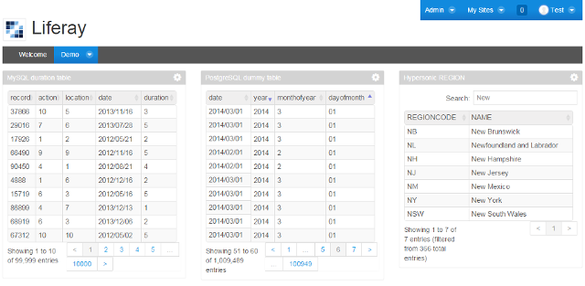
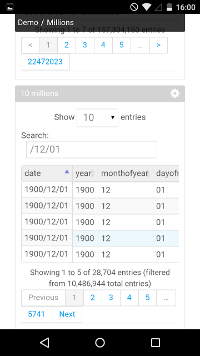

# SQL DataTable portlet for Liferay
Aimed to deliver a simple and fast option to analyze multiple databases in a single portal, this portlet can execute plain SQL queries using multiple connection pools, across different database engines. The result is render in HTML using JQuery DataTables, balancing client and server side processing.

DataTables is a popular open source JQuery plugin designed to enhance the accessibility of data in HTML tables, providing pagination, sort and search capabilities, with several options and extensions to support typical end user and developer requirements.

To support millions of rows, a server side processing was implemented to search, sort and paginate results using SQL database capabilities. But for small tables, the portlet switch the processing to the client side, avoiding AJAX call overloads and improving response times. 

This was possible due to a tight integration with DataTables and reusing Liferay data source libraries, witch also accelerate the development.

Its is a spin-off of a larger project, with simplified configuration, without additional infrastructure requirements. It lacks of metadata management, caching mechanisms and abstraction of queries and connections. But with the right configuration it can execute your SQL fast and it is easy to uninstall.

## Database support
Supports the same databases that Liferay Portal support, including MySQL, PostgreSQL, DB2, Oracle, SQL Server, Hypensonic. Also can be configured to work with C3P0, Apache DHCP or Tomcat connection pool libraries.

## DataTables extension support
By default supports three DataTables extensions. [FixedColumns](https://www.datatables.net/extensions/fixedcolumns/), [ColReorder](https://www.datatables.net/extensions/colreorder/), [HighlightingColumns](https://datatables.net/examples/api/highlight.html), other can be injected through portlet configuration.

## Current status
First pre-release. The first release will support only Liferay 6.2+, targeting MySQL and PostgreSQL with CP3P0.

## Source Code
[This](https://github.com/flarroca/sql-datatable-portlet) is the main source code repository of the project.

## Quick Start
You need a running Liferay Portal 6.2+ to deploy this portlet. A pre-build portal can be found at [Liferay download page](http://liferay.com/downloads), follow this [step-by-step guide](http://liferay.com/quick-start) to run your own portal.

Download the .lpkg file from the [Liferay Marketplace](http://www.liferay.com/marketplace) or the .war file from this repository.

Go to the portal *Control Panel* > *Apps* > *App Manager* > *Install*, select the .lpkg or .war file and click Install.  The portlet will be available to place on any page. You can monitor connections pools in *Control Panel* > *Configuration* > *SQL Pools*.

Drop the portlet in the page, go to the portlet configuration, select the database driver, enter the database URL, user and password, and paste your SQL. 

## Bug tracker and feature requests
Comments, critics, bugs and new feature requests are very appreciated. Please place any issue [here](https://github.com/flarroca/sqldatatable-portlet/issues/new).  

## Contributions and license
All kind of contributions are welcome. This repository is public and includes the required source code to build and debug the portlet. The proposed license is Apache version 2, see [LICENSE](https://raw.githubusercontent.com/flarroca/sqldatatable-portlet/master/LICENSE)
